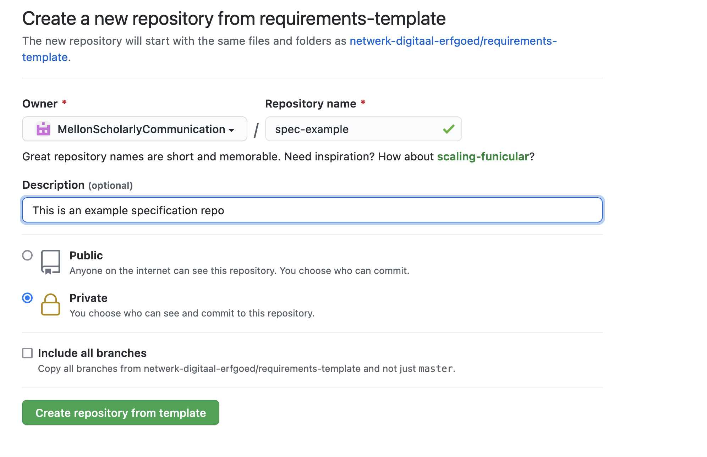

# Requirements Template

This is the template for requirements published by Netwerk Digitaal Erfgoed.

Requirements are written in Markdown and transformed to HTML using the
[Bikeshed preprocessor](https://tabatkins.github.io/bikeshed/).


## Usage

1. Create a new repository using this template by clicking the green _Use this template_ button on Github.


2. Fill in the necessary repository information.


   
1. Clone the new repository using `git clone https://github.com/<your_repository>` and edit the `index.bs` to start the requirements specification writing!

## Generate HTML locally

To view HTML output locally (using a [Docker container](https://github.com/netwerk-digitaal-erfgoed/bikeshed-docker)),
run:

```bash
make spec
```

and open the `index.html` file:

```bash
open index.html
```

**WARNING: Do NOT add the generated `index.html` to your `.gitignore` as this will make github actions unable to automatically publish the rendered version of your specification on github pages.**

Alternatively, to update the HTML every time you make changes to [the source document](index.bs):

```bash
make watch
```
